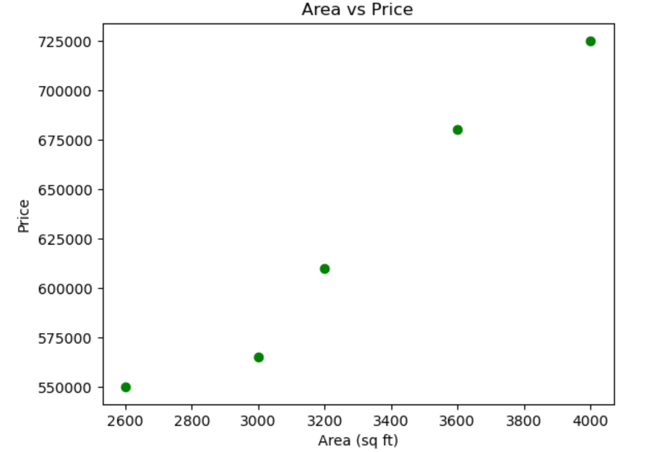
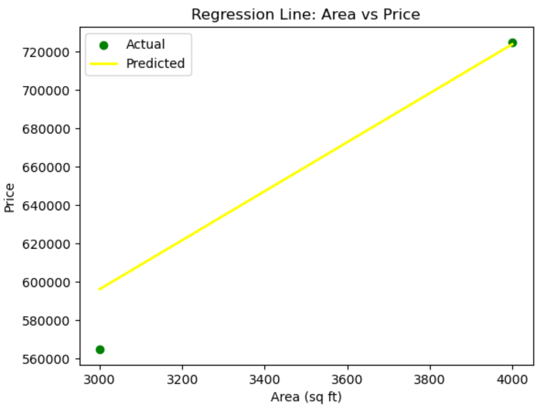

 # Linear Regression Model 📈

This repository contains a simple walkthrough of building a **Linear Regression model** using Python and Scikit-learn. The project focuses on exploring a dataset, preparing the data, building the model, evaluating its performance, and visualizing the results.

---

## 📌 Project Objectives:

The main tasks covered in this project include:

1. **Explore the Dataset:**  
   - Load the dataset  
   - Understand its structure  
   - Visualize relationships using scatter plots  

2. **Prepare the Data:**  
   - Handle missing values (if any)  
   - Split the data into training and testing sets  

3. **Build the Model:**  
   - Use **Scikit-learn's LinearRegression** class  
   - Fit the model on the training data  

4. **Evaluate the Model:**  
   - Calculate evaluation metrics:  
     - Mean Absolute Error (MAE)  
     - Mean Squared Error (MSE)  
     - Root Mean Squared Error (RMSE)  
     - R² Score  

5. **Visualize the Results:**  
   - Plot the regression line against actual data points  

---

## 📂 Repository Contents:

- **Linear regression model.ipynb**  
  The main Jupyter Notebook containing all the steps: from data loading to model evaluation and visualization.

---

## 🛠️ Tools and Libraries Used:

- Python 3.x
- Jupyter Notebook
- Pandas
- NumPy
- Matplotlib
- Scikit-learn (sklearn)

---

## ✅ Steps:

### 1. Exploring the Dataset
- Loaded the dataset using **Pandas**.
- Used `.head()` and `.describe()` to understand data types and summary statistics.
- Created **scatter plots** with **Matplotlib** to explore the relationship between variables.

### 2. Preparing the Data
- Checked for missing values.
- Selected features (independent variables) and the target (dependent variable).
- Split the data into **training set** and **test set** using `train_test_split` from **scikit-learn**.

### 3. Building the Linear Regression Model
- Imported `LinearRegression` from `sklearn.linear_model`.
- Created a model instance.
- Fitted the model using the **training data**.

### 4. Evaluating the Model
- Made predictions on the **test set**.
- Calculated evaluation metrics:
  - **Mean Absolute Error (MAE)**
  - **Mean Squared Error (MSE)**
  - **Root Mean Squared Error (RMSE)**
  - **R² Score** (Coefficient of Determination)
- Interpreted the results to assess model accuracy.

### 5. Visualizing the Results
- Plotted the **actual vs. predicted values**.
- Visualized the **regression line** over the scatter plot of test data to check how well the model fits.

---

## 📊 Sample Output Visualizations:

Some of the key plots included in the notebook:

- **Scatter plot** showing the data distribution,illustrating the relationship between the independent variable and the target variable. Each green dot represents an observation.
 
- **Regression line plot** The yellow line showing predicted values against actual data points.
 

*(View the notebook for full code and outputs.)*

---
